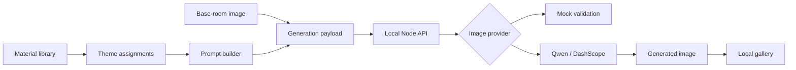

# Utopia

Utopia is a human–AI co-creation prototype that turns physical material references into interior design concepts.

Instead of asking users to write a long image-generation prompt, the interface lets them choose tangible references—such as oak, linen, stone, or a paper lantern—and assign each reference a design role: **Function**, **Material**, **Mood**, **Furniture**, or **Nature**. Utopia translates those choices into a structured prompt, combines it with a base-room image, and sends the result to an image-generation service.

> **Project status: Active development.** The core interaction prototype and local API pipeline are working, but the product, architecture, and generation experience are still evolving. APIs and implementation details may change. A mock provider is included for local development; real image output requires Qwen/DashScope credentials.

## Development status

### Working now

- Browse and filter the material library
- Assign materials to five spatial design roles through drag and drop
- Build structured prompts from material metadata and role semantics
- Prepare and validate multimodal generation payloads
- Run the backend with either a mock or Qwen/DashScope provider
- Store returned images and assignment snapshots in a browser-local gallery
- Switch between five interface languages

### Current development priorities

- Break the main Utopia screen into smaller, easier-to-test components
- Improve loading, empty, and error states across the generation flow
- Add automated tests for prompt construction, payload validation, and core interactions
- Validate the Qwen workflow more thoroughly with real generation requests
- Improve responsive behavior and accessibility across different devices

### Longer-term direction

- User-provided room images and camera input
- Persistent projects, accounts, and cloud-backed galleries
- A larger, editable material catalogue
- More image providers behind the same server-side interface
- Production deployment, monitoring, and usage controls

## Why this project exists

Most generative-design tools begin with an empty text box. That assumes users already know how to describe spatial qualities in prompt language. Utopia explores a more approachable interaction model: people compose a space through familiar objects and materials, while the application handles prompt construction behind the scenes.

The prototype focuses on three questions:

- Can physical references make AI-assisted design more intuitive?
- Can one material express different ideas depending on its assigned design role?
- Can the system preserve user intent while translating references into a usable generation prompt?

## Core experience

1. Open the object library and browse or search material references.
2. Drag a reference onto one of five spatial roles.
3. Inspect the selected combination and generate a design.
4. The frontend converts the base room to a data URL and builds a structured request.
5. The local API validates the request and delegates it to either the mock or Qwen provider.
6. Generated images are saved to the local gallery with a snapshot of their material assignments.

## Features

- Drag-and-drop material assignment across five design roles
- Searchable, filterable object library with detailed material cards
- Metadata-driven prompt generation using keywords, spatial impressions, and typical applications
- Local image-generation API with request validation and explicit error handling
- Swappable `mock` and `qwen` image providers
- Generated-image gallery persisted in browser `localStorage`
- Result detail view with material provenance and image download
- Interface translations for English, Japanese, Simplified Chinese, Traditional Chinese, and Thai
- Responsive interface built from reusable React and CSS components

## Architecture



The repository is split into a React frontend and a small Node.js API:

- `frontend/src/features/utopia/` owns the main experience, domain types, material metadata, prompt construction, and API client.
- `frontend/src/app/` contains application bootstrap and routing.
- `frontend/src/shared/` contains reusable UI primitives.
- `server/src/routes/` validates HTTP requests and selects the configured provider.
- `server/src/services/` contains the Qwen/DashScope adapter.

For a code-level walkthrough, state ownership, request lifecycle, and extension points, see [Architecture Guide](docs/ARCHITECTURE.md).

## Tech stack

| Area | Technology |
| --- | --- |
| UI | React 19, TypeScript, CSS |
| Routing | React Router 7 |
| Build tooling | Vite 8 |
| API | Node.js HTTP server, TypeScript |
| Development runtime | TSX |
| Image generation | Mock provider or Qwen/DashScope |
| Quality checks | TypeScript, Oxlint |

## Run locally

### Prerequisites

- Node.js `^20.19.0` or `>=22.12.0`
- npm

### 1. Install dependencies

```bash
npm install --prefix frontend
npm install --prefix server
```

### 2. Configure the local API

The frontend already targets `http://localhost:8787` through `frontend/.env`.

Create the server environment file:

```powershell
Copy-Item server/.env.example server/.env
```

The default configuration uses the mock provider:

```env
PORT=8787
UTOPIA_IMAGE_PROVIDER=mock
```

Mock mode validates the full request flow and returns debug metadata, but it does not return a generated image. Use the Qwen setup below when you need gallery output.

### 3. Start both processes

Terminal 1 — frontend:

```bash
npm run dev
```

Terminal 2 — API:

```bash
npm run dev:server
```

Open [http://localhost:5173](http://localhost:5173).

## Enable Qwen image generation

Update `server/.env` with your own credentials and endpoint:

```env
PORT=8787
UTOPIA_IMAGE_PROVIDER=qwen
QWEN_API_KEY=your_api_key
QWEN_IMAGE_MODEL=qwen-image-2.0-pro
QWEN_API_URL=your_dashscope_multimodal_generation_endpoint
QWEN_WATERMARK=false
QWEN_PROMPT_EXTEND=true
```

`server/.env` is ignored by Git. Do not commit API keys.

The provider adapter expects a DashScope multimodal response whose content contains an image URL. Provider failures are normalized into configuration, authentication, request, or response errors before being returned to the frontend.

## Available scripts

Run these commands from the repository root:

| Command | Purpose |
| --- | --- |
| `npm run dev` | Start the Vite frontend |
| `npm run dev:server` | Start the local API in watch mode |
| `npm run build` | Build the frontend |
| `npm run build:server` | Compile the server |
| `npm run typecheck` | Type-check the frontend |
| `npm run typecheck:server` | Type-check the server |
| `npm run lint` | Lint the frontend |
| `npm run preview` | Preview the production frontend build |

## API overview

### `POST /api/generate-utopia-image`

Request shape:

```ts
type GenerateUtopiaImageRequest = {
  baseImageDataUrl: string
  promptText: string
  assignments: Partial<Record<UtopiaThemeId, MaterialId>>
  materialsSnapshot: MaterialMetadata[]
}
```

Successful responses include the final prompt and optional provider metadata. A real provider also returns `imageUrl` or `imageDataUrl`.

The server rejects malformed JSON, missing prompts, invalid image data URLs, unsupported methods, oversized requests, and unknown providers with readable JSON errors.

## Important implementation decisions

- **Domain data is separate from UI copy.** Material metadata drives prompt behavior, while translations only control presentation.
- **Assignments use stable IDs.** The UI stores `themeId → materialId` rather than copying whole objects into component state.
- **Generation snapshots are reproducible.** Every request includes the material metadata used at generation time.
- **Provider code stays behind the API.** Secrets and vendor-specific request formats never enter the frontend bundle.
- **The mock provider is the safe default.** Contributors can run and inspect the pipeline without external credentials or API cost.

## Current limitations

- Gallery data is browser-local and has no user account or cloud synchronization.
- The mock provider does not synthesize placeholder images.
- Material data and translations are currently static source files.
- The main Utopia screen still contains several UI subcomponents and is a candidate for further decomposition.
- Automated unit and end-to-end tests have not yet been added.

These are known boundaries of the current work in progress, not production-ready capabilities. They are documented openly so reviewers can distinguish implemented behavior from planned work.

## Repository structure

```text
utopiamain/
├── frontend/
│   ├── public/                 # Public icons and favicon
│   └── src/
│       ├── app/                # App bootstrap, providers, routes, config
│       ├── assets/             # Local images and SVG assets
│       ├── features/
│       │   ├── utopia/         # Main domain and generation workflow
│       │   ├── object-library/ # Library components and legacy prototype data
│       │   ├── object-board/   # Experimental board components
│       │   └── space-generation/
│       ├── pages/              # Route-level page components
│       ├── shared/             # Reusable UI components
│       └── styles/             # Reset, tokens, and global styles
├── server/
│   └── src/
│       ├── routes/             # Validation and HTTP response handling
│       ├── services/           # External image-provider adapters
│       ├── index.ts            # HTTP server entry point
│       └── types.ts            # API domain types
├── docs/
│   └── ARCHITECTURE.md         # Detailed code and data-flow guide
└── package.json                # Root development commands
```

## What this project demonstrates

- Translating a design-research concept into an interactive product prototype
- Modeling a domain with strict TypeScript types and metadata-driven behavior
- Separating UI, prompt engineering, payload preparation, HTTP validation, and provider integration
- Designing graceful local development paths for both offline and credentialed workflows
- Building interaction-rich interfaces with drag-and-drop, overlays, localization, persistence, and responsive layouts
