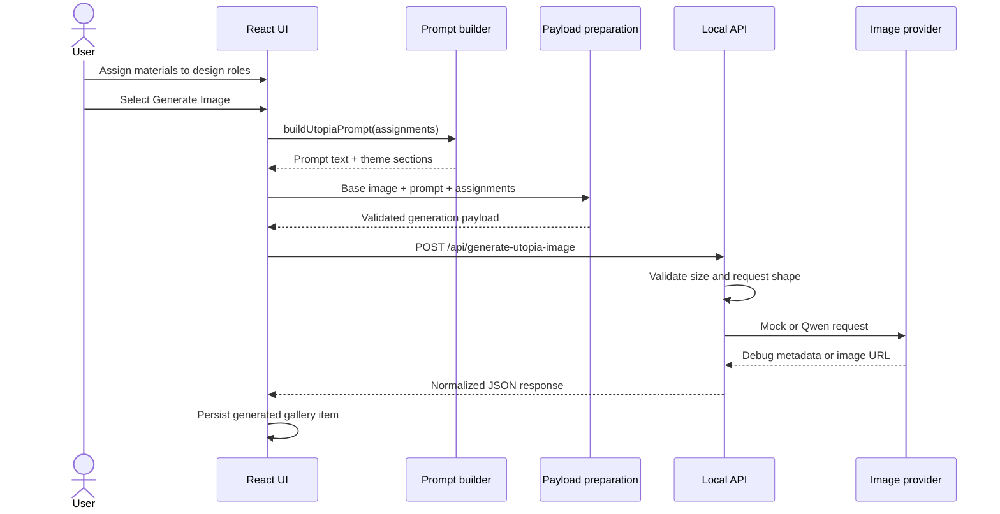

# Utopia Architecture Guide

This document explains the architecture of the current work-in-progress implementation, how data moves through the application, and where to make common changes. It is intended for reviewers and contributors who want to understand the code beyond the project overview. The architecture will continue to evolve as the prototype is developed.

## System boundaries

Utopia has two runtime processes:

1. A Vite-powered React single-page application on port `5173`.
2. A Node.js HTTP API on port `8787`.

The browser owns interactive state and presentation. The server owns request validation, secrets, and provider-specific image-generation calls.



## Frontend composition

The application starts in `frontend/src/main.tsx`, mounts `App`, and uses `AppRouter` to render `UtopiaPage`. Both `/` and `/utopia` currently resolve to the same page.

The active product experience lives in:

```text
frontend/src/features/utopia/
├── components/UtopiaCollectionScreen.tsx
├── data/materials.ts
├── data/themes.ts
├── prompt/buildUtopiaPrompt.ts
├── services/generateUtopiaImage.ts
├── services/prepareUtopiaGenerationPayload.ts
├── utils/imageAssetToDataUrl.ts
└── types.ts
```

### State ownership

`UtopiaCollectionScreen` is the current feature controller. It owns:

- active Utopia or Collection view;
- selected interface language;
- object-library and account overlays;
- design-role assignments;
- payload and API progress/error state;
- generated gallery items and the active result overlay.

UI-only state that does not need to leave a subcomponent stays local. Examples include the active library category, search query, detail-card side, and open element menu.

### Domain model

Five `UtopiaThemeId` values describe how a reference should influence the generated room:

| Theme ID | UI card | Meaning |
| --- | --- | --- |
| `function` | Function | Room purpose and activities |
| `material` | Material | Surfaces, finishes, and construction qualities |
| `atmosphere` | Mood | Light, ambience, and emotional character |
| `furniture` | Furniture | Furnishing type, placement, and upholstery |
| `nature` | Natural | Daylight, plants, stone, water, and organic elements |

`UtopiaThemeAssignments` is a partial mapping from one of these theme IDs to a stable material ID. A partial mapping allows the user to generate from any non-empty subset of roles.

### Material metadata

`data/materials.ts` is the domain catalogue used by both the interface and prompt builder. Each material contains:

- identity and category;
- local preview image;
- descriptive keywords;
- spatial impressions;
- typical architectural or furniture applications;
- a human-readable description.

To add a material, extend `MaterialId`, add its metadata and asset, and provide the necessary localized labels/detail content used by the current screen.

### Prompt construction

`prompt/buildUtopiaPrompt.ts` is intentionally independent of React. Its only input is the assignment map, which makes the transformation deterministic and suitable for future unit tests.

The builder:

1. Starts with base instructions that preserve perspective, room structure, lighting, and architectural plausibility.
2. Walks through the five theme definitions in a stable order.
3. Looks up each assigned material's metadata.
4. Converts the same material into different instructions depending on its theme role.
5. Returns the final prompt, per-theme prompt sections, and a deduplicated material list.

Role-specific exceptions for particularly important combinations are kept close to the generic theme logic so their precedence is visible.

### Payload preparation

Before calling the API, the frontend:

1. Fetches the bundled base-room asset.
2. Converts its image blob into a data URL.
3. Verifies that the prompt and image are present.
4. Copies current assignments.
5. Creates a deduplicated `materialsSnapshot`.

The metadata snapshot records what the selected material meant at generation time. This becomes important if catalogue descriptions change later.

### Gallery persistence

When a provider returns an image, the screen creates a gallery item containing:

- provider request ID or timestamp fallback;
- returned image URL/data URL;
- a snapshot of the theme assignments.

Items are stored under `utopia_gallery_items` in browser `localStorage`. This is prototype persistence only; it is not synchronized between browsers or users.

## Server request lifecycle

The Node entry point in `server/src/index.ts` creates a deliberately small HTTP server. It enables local CORS, routes generation requests, handles preflight requests, and returns JSON for unknown routes.

`server/src/routes/generateUtopiaImage.ts` performs the application-level work:

1. Allow only `POST` and `OPTIONS`.
2. Read the body with a 15 MB limit.
3. Parse JSON and validate required top-level fields.
4. Select the provider from `UTOPIA_IMAGE_PROVIDER`.
5. Normalize successful and failed responses into the public API shape.

Provider selection is explicit. An unknown value fails rather than silently falling back, which makes environment mistakes easier to diagnose.

## Provider adapters

### Mock

The mock provider returns the final prompt and debug details without calling an external service. It proves that frontend prompt creation, payload conversion, HTTP transport, server validation, and response parsing all work without credentials.

It intentionally does not return an image, so it does not create a gallery card.

### Qwen / DashScope

`server/src/services/qwenImageClient.ts` owns:

- environment validation;
- the vendor request format;
- authorization headers;
- response parsing;
- provider-specific error classification.

The adapter sends the base image and prompt as one multimodal user message. It extracts the first image content item from the first returned choice and exposes only the normalized result to the route.

API keys remain server-side and are never returned or logged.

## Error boundaries

Errors are separated by stage so the interface can distinguish local payload preparation from remote API failure:

- Asset conversion errors occur before any network call to the local API.
- Payload validation errors describe missing or invalid frontend inputs.
- Route validation errors return HTTP `400` or `405` with JSON messages.
- Provider configuration errors return HTTP `500`.
- Provider failures return HTTP `502` with a normalized category.

## Where to make common changes

| Change | Primary location |
| --- | --- |
| Add or edit a material | `frontend/src/features/utopia/data/materials.ts` |
| Change role semantics | `frontend/src/features/utopia/data/themes.ts` |
| Change prompt behavior | `frontend/src/features/utopia/prompt/buildUtopiaPrompt.ts` |
| Change generation payload | Frontend/server `types.ts` plus payload preparation and route validation |
| Add an image provider | `server/src/services/` and the provider switch in the generation route |
| Add a route/page | `frontend/src/app/router/` and `frontend/src/pages/` |
| Change global design tokens | `frontend/src/styles/tokens.css` |
| Change the main experience | `frontend/src/features/utopia/components/UtopiaCollectionScreen.tsx` |

## Safe extension patterns

When adding a provider, keep vendor response types and credentials inside its server adapter. Return the existing normalized `GenerateUtopiaImageResponse` from the route.

When adding prompt rules, prefer metadata and theme-driven behavior over UI conditionals. The prompt layer should remain callable without rendering React.

When adding persistence, replace the `localStorage` boundary behind a small repository/service module before introducing authentication or cloud storage. This keeps UI state independent from storage technology.

## Known refactoring opportunities

`UtopiaCollectionScreen.tsx` currently contains the feature controller, translation data, icons, overlays, and several subcomponents. The most valuable future refactor is to extract those pieces without changing their public behavior:

- move translations into dedicated locale modules;
- move gallery persistence into a hook or repository;
- split account, library, result, and home views into separate component files;
- share API/domain schemas between frontend and server;
- add unit tests for prompt/payload logic and end-to-end coverage for the drag-to-generation path.

These are documented as deliberate next steps rather than hidden as if the prototype were already production-complete.
